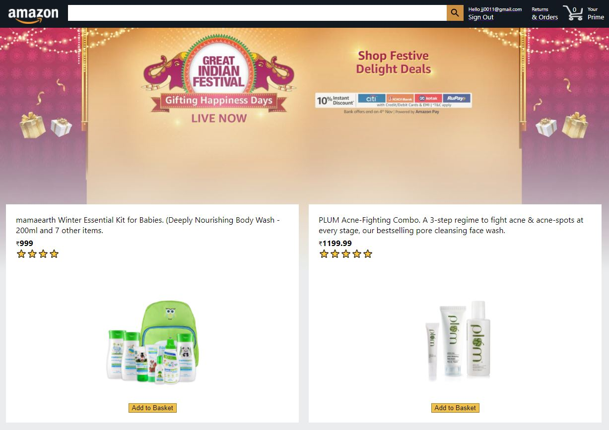
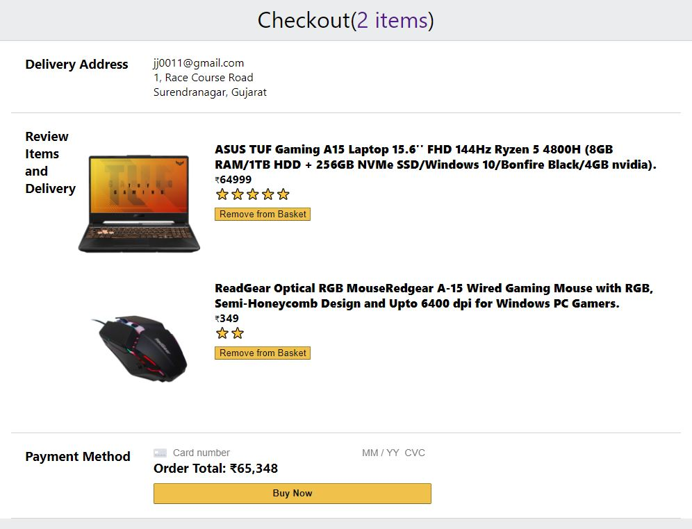
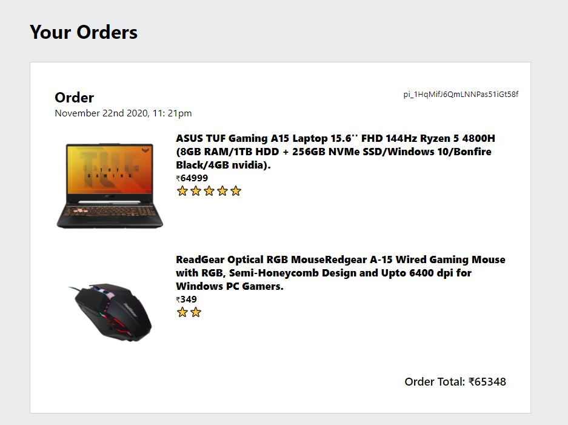

# Amazon Clone
<h4>Amazon Clone Full Stack Application. (ReactJS, Express, Node.js and Firebase🔥)</h4>

Check this URL: <a href="https://clone-b1ab4.firebaseapp.com" target="_blank">https://clone-b1ab4.firebaseapp.com</a>

<h1>Steps</h1>
<h3>1) Login or Signup</h3>

<h3>2) Add Products</h3>

<h3>3) Go for Payment</h3>

<h3>4) View all your orders</h3>

<h2><a href="https://clone-b1ab4.firebaseapp.com/" target="_blank">DEMO LINK </a>here</h2>

